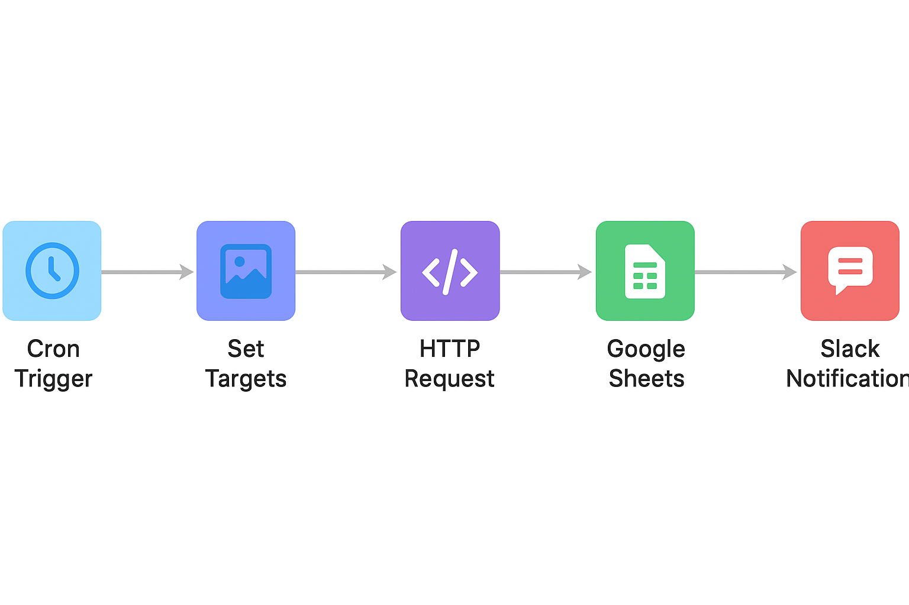

# 🟢 Competitor Tracker n8n Workflow – Step by Step

### **Goal:**

Trigger the scraping automatically and store results in Google Sheets, optionally send notifications.

---

## **1️⃣ Cron Trigger Node**

**Purpose:** Run the workflow automatically at a schedule (e.g., daily).

**Steps:**

1. Drag **Cron** node to the canvas.
2. Configure:

   * **Mode:** Every Day / Every Hour / Custom
   * **Time:** e.g., 09:00 for daily at 9 AM
3. Name it: `Daily Trigger`
4. Connect the output to the next node (`Set Node`).

> This node starts the workflow automatically without manual execution.

---

## **2️⃣ Set Node**

**Purpose:** Define the targets you want the scraper to run on. Optional: you can also let the server read from `config/sites.json`.

**Steps:**

1. Drag **Set** node and connect from Cron.
2. Click **Add Value** → Choose **Type = JSON**.
3. Enter the list of targets as JSON:

```json
[
  {
    "url": "https://example.com/product/1",
    "selectors": {
      "title": "h1",
      "price": ".price",
      "availability": ".stock"
    },
    "device": "desktop"
  },
  {
    "url": "https://example.com/product/2",
    "selectors": {
      "title": "h1",
      "price": ".price",
      "availability": ".stock"
    },
    "device": "mobile"
  }
]
```

4. Name it: `Set Targets`.

> Tip: If you leave this blank, the Replit server will automatically use `config/sites.json`.

---

## **3️⃣ HTTP Request Node**

**Purpose:** Call your Replit API `/run` to trigger scraping.

**Steps:**

1. Drag **HTTP Request** node and connect from `Set Targets`.
2. Configure:

   * **HTTP Method:** POST
   * **URL:** `https://YOUR_REPLIT_URL/run`
   * **Authentication:** None (we will use header)
   * **Headers:**

     * Key: `x-job-secret`
     * Value: The secret you set in Replit `.env` (e.g., `JOB_SECRET=abc123`)
   * **Body Content Type:** JSON
   * **Body Parameters:**

     ```json
     {
       "targets": {{$json}},
       "options": {"screenshots": true}
     }
     ```
3. Name it: `Call Replit /run`.

> This node sends the target list to your Replit server and returns scraped data.

---

## **4️⃣ Google Sheets Node**

**Purpose:** Save scraped data to a sheet automatically.

**Steps:**

1. Drag **Google Sheets** node and connect from HTTP Request.
2. Configure:

   * **Operation:** Append
   * **Sheet ID:** Copy your sheet ID from Google Sheets
   * **Range:** e.g., `Sheet1!A:E`
   * **Value Input Mode:** User-entered
   * **Columns:** `date`, `url`, `device`, `title`, `price`, `availability`
   * **Data:** Map fields from HTTP Request output:

```javascript
{{$json["results"].map(r => ({
  date: new Date().toISOString().slice(0,10),
  url: r.url,
  device: r.device,
  title: r.title,
  price: r.price,
  availability: r.availability
}))}}
```

3. Name it: `Append to Sheet`.

> This node automatically logs scraped data daily.

---

## **5️⃣ Notifications Node (Optional)**

**Purpose:** Send alerts after scraping. You can use Slack, Email, Telegram, etc.

**Steps (Slack example):**

1. Drag **Slack** node and connect from Google Sheets.
2. Configure:

   * **Operation:** Post Message
   * **Channel:** `#your-channel`
   * **Message:** `"Scraping completed: {{$json["results"].length}} items scraped today."`
3. Name it: `Slack Notification`.

> You can also use Email or any other integration supported by n8n.

---

## **6️⃣ Key Tip: Prevent Duplicates**

* Create a unique key for each row:
  `key = url + date`
* Before appending to Google Sheets, check if the key already exists.
* This ensures the same product isn’t added twice on the same day.

---

## **✅ Workflow Summary**

```
[ Cron Trigger ] → [ Set Targets ] → [ HTTP Request /run ] → [ Google Sheets Append ] → [ Notifications ]
```

* Cron → Automatic schedule
* Set → Define products to scrape
* HTTP Request → Call Replit scraper API
* Google Sheets → Save data
* Notifications → Optional alerts



